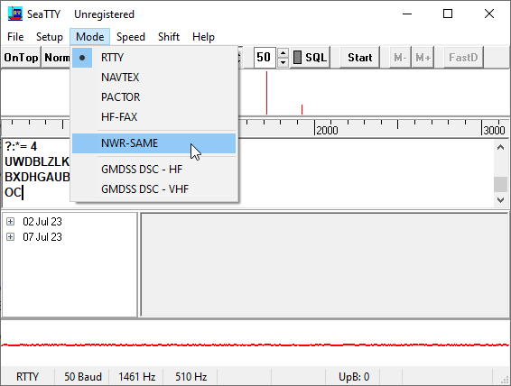

# Tornado Warning

## Challenge Description
```
117 Points
misc, extreme, radio

"Check out this alert that I received on a weather
radio. Somebody transmitted a secret message via
errors in the header! Fortunately, my radio corrected
the errors and recovered the original data. But can
you find out what the secret message says?

Note: flag is not case sensitive."

Author: Pomona
```
<details>
  <summary>Hint 0</summary>
  The header is encoded with Specific Area Message Encoding.
</details>

<details>
  <summary>Hint 1</summary>
  The three buzzes are supposed to be identical, but in this challenge, they are different due to errors.
</details>

Challenge File: [warning.wav](warning.wav)

## TL;DR

For this challenge, you are given a wav file of an emergency alert.  This alert is transmitted with the Specific Area Message Encoding (SAME) protocol.  Messages sent through this protocol consist of four parts, the first of which is the header.  The header contains information that can be deciphered by software such as SeaTTY.  Doing so reveals the scrambled header.  We then compare each of the three lines in the header with each other and identify differing characters from left to right.  Doing so reveals the flag given below.

## Background

<a href="http://www.youtube.com/watch?feature=player_embedded&v=rF4BCMs-8BE" target="_blank">
  
</a>

When I first listened to the provided wav file on an accidentally high volume, it scared the hell out of me.  If you live(d) in the US, chances are it startled you too because it's from the infamous _Emergency Alert System (EAS)_, a national warning system known for its creepy beginning.  However, interestingly enough, the three initial triggering beeps do more than frighten kids.  They transmit data!

Looking at the challenge description, it mentions a "header" in the audio file.  On the [EAS Wikipedia page](https://en.wikipedia.org/wiki/Emergency_Alert_System), you can find the word "header" mentioned in the second paragraph, and right before it, you can find a sentence talking about the EAS's `application of a digitally encoded audio signal known as Specific Area Message Encoding (SAME)`.  This is important since it has to do with how data is encoded into emergency broadcasts.  SAME is the protocol used for this, and according to the [Wikipedia page](https://en.wikipedia.org/wiki/Specific_Area_Message_Encoding), it is also used for weather alerts.  Hint 0 tells us this, but at this point, it's pretty safe to assume that this wav file uses the SAME protocol, and a little more investigation will confirm this.

Of course, I've explained how to find SAME assuming you know the EAS, but this is still possible if you didn't.  Relevant search phrases like "radio weather alert header" utilize the key pieces of information from the first part of the description, and they bring up SAME as the top search results.

So, to find the flag, we should investigate the SAME protocol and what exactly headers are.

## SAME

A delve into the Wikipedia page will help us uncover what the protocol entails.  From the [full message format](https://en.wikipedia.org/wiki/Specific_Area_Message_Encoding#Full_message_format) section, we find that a message consists of 4 parts:
  1. **Header** - Consists of information about who is sending the alert, the emergency itself, locations affected, and more.
  2. **Attention Signal** - A single, long tone that indicates if a message is included.
  3. **Message** - The actual audio you listen to for information about the alert.
  4. **Tail** - A trailing tone with no information that signals the end of the message.

The header and tail are transmitted three times, which corresponds to the three tones played at the beginning and end of each transmission.  So, we can now understand what an EAS broadcast consists of:
```
       Message:  beeeeep beeeeep beeeeep booooooooooooooooooooop *talking about tornado* beep beep beep
SAME Component:  |        header        |    Attention Signal   |        Message        |     Tail    |
```

We know from the problem description that something is up with the header, so we need some way to extract information from the header.  I originally tried to extract this information manually, but there is a more straightforward direction that I will present first.

## Decoding The Header

The information in the header could be manually extracted.  If you wanted to, you could delve into the [specification](https://www.nws.noaa.gov/directives/sym/pd01017012curr.pdf) of the SAME protocol and see that the data is encoded by representing 0 and 1 bits as different frequency signals.  It's pretty cool to open the wav file in software like Audacity and to zoom in and see this shift in frequency!


However, **this is not a smart route**.  I wasted a lot of time on this, and I couldn't get code working to do this.  Eventually, I came to the conclusion that since this is a standardized protocol, there's probably software to decode this already.  With some Googling, I came across [this forum post](http://forums.radioreference.com/threads/same-decoding.271140/post-2210417), which recommends three different programs to decode SAME messages.  **NOTE:  These only work on Windows.  There are alternatives for Linux such as [sameold](https://github.com/cbs228/sameold) in Rust or these [NWR tools](https://github.com/ghewgill/nwr), but I have not tested them.**

I downloaded the first suggestion, [SeaTTY](http://www.dxsoft.com/en/products/seatty/).  After installing the program, you can read through information about the program by going to Help > Contents.  However, to decode the header, simply do the following:
  1.  Switch the Mode to NWR-SAME by selecting Mode > NWR-SAME.



  2.  Clear the buffer for better readability by selecting File > Clear Buffer.


  3.  Open the warning.wav file by selecting File > Decode From File and then selecting the file in File Explorer.


You should obtain output similar to the following:
```
ZCZC-UXU-TFR-R18007ST_45-0910BR5-KIND3RWS-____
ZCZC-WIR-TO{3018W0R+00T5-09UT115-K_EV/NWS-
____
ZCZC-WXRCTOR-0D_007+004OR_O1011E@KIND/N}S-
____
NNNN____
NNNN
____
NNNN____
```
Referring to either the Wikipedia page or the specification, we can immediately recognize that `NNNN____` as the tail.  We can also note that the header should have a format of `ZCZC-ORG-EEE-PSSCCC+TTTT-JJJHHMM-LLLLLLLL-`, and since it repeats three times, we should see three identical lines of that format.  However, the first three lines don't follow the format exactly, and they aren't even identical!  What's going on?

## Uncovering The Flag

We know that there are errors in the header due to a secret message, so the flag is most likely causing these lines not to be identical (Hint 1 confirms this).  So, let's go through the three lines, character by character, and identify where they differ.  We'll use a sort of [three-fold repetition code](https://en.wikipedia.org/wiki/Error_correction_code#Method) to identify the hidden characters.  This means whenever the characters differ, we will have one character different from the others, so we will treat the one character as incorrect since it is in the minority.  This will hopefully reveal enough of the characters of the secret message to help us figure out the message.  Going column by column reveals the following:


Here, some of the columns had no differing letters, so they are filled in as red.  However, we can see that going by writing out the odd characters column-wise, we get almost the entire flag out in plaintext!  The columns that are missing seem to be missing since every single letter in that column is the same.  So, we obtain the flag.

```
UIUCTF{3RD_W0RST_TOR_OUTBRE@K_EV3R}
```

---
[Visit Our Other Writeups!](../..)
